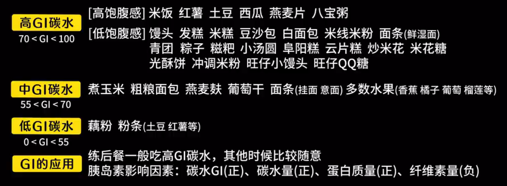
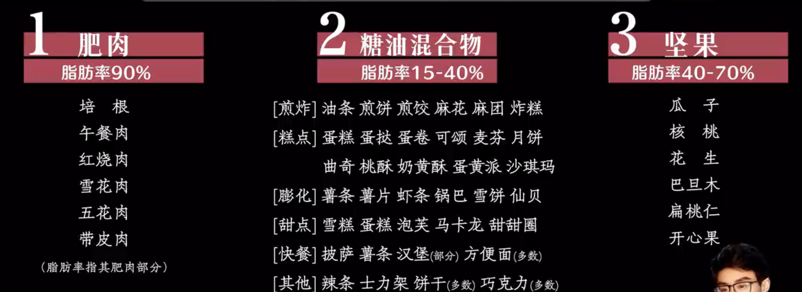

参考：
- [新手训练手册](https://www.bilibili.com/video/BV1Hk4y187jF/?spm_id_from=333.788.top_right_bar_window_default_collection.content.click)
- [新手饮食手册](https://www.bilibili.com/video/BV1yX4y1q7LP/?spm_id_from=333.788.top_right_bar_window_default_collection.content.click)

<!-- more -->

## fitness

### 热身

### 分化训练：利用肌肉的协同关系

#### 1. 胸 + 肩前中束 + 肱三头

核心动作：各种卧推、飞鸟等

推胸主要包含三种关节动作：
1. 肩关节水平内收：将大臂由身体外侧向躯干前方拉拢，主要用到 **胸大肌 + 肩前束**
2. 肩关节屈：将大臂从身体后侧拉到前侧的动作，主要用到 **肩前束 + 胸肌上束**
3. 肘关节伸：肘关节从折叠变为打直的动作，主要用到 **肱三头**

飞鸟相比推胸，只包含肩关节水平内收的动作，可以作为辅助动作

实验证明卧推类动作除了胸大肌外，也会刺激到肩前束、肱三头，在胸推类动作结束后附加少量肩前束/肱三头动作即可达到刺激效果

> *在更加细分的训练法中，也会将肩部前后束，肱二/三头单独拎出来作为一次训练，即四分，五分法*

肩前束核心动作：推举，包括：
1. 肩关节屈：**肩前束 + 胸肌上束**
2. 肩关节外展：**肩中束 + 岗上肌**
针对前束和中束可以做一些辅助动作，如前平举针对前束，侧平举针对中束

肱三头核心动作：臂屈伸，也就是肘关节伸

#### 2. 背 + 肩后束 + 肱二头

核心动作：各种划船、下拉等

划船主要包含两种关节动作：
注意：下背划船如窄距机械划船、哑铃划船等，开肘角度较小，不会用到肩关节外展，而上背划船如杠铃俯身划船，开肘较大，会用到肩关节外展
1. 肩关节伸：将大臂从前侧拉到后侧，主要用到 **背阔肌 + 大圆肌 + 肱三头 + 肩后束**
2. 肩关节水平外展：将大臂从身体内侧向外拉，主要用到 **肩后束 + 冈下肌**

下拉主要涉及肩关节内收，主要用到 **背阔肌 + 大圆肌** 同时，高位下拉时的窄距和宽距动作用到的肌肉也不一样。宽距一般涉及大臂由外向内，即肩关节内收；窄距一般涉及大臂由前往后，即肩关节伸

练背会带到一些肱二头，肱二头核心动作：弯举，也就是肘关节屈

#### 3. 腿 + 腹

练腿核心动作：
1. 膝关节伸：膝关节折叠变为打直，主要用到 **股四头**
2. 膝关节屈：膝关节打直变为折叠，主要用到 **腘绳肌**
3. 髋关节伸：大腿从前方往后方运动，主要用到 **腘绳肌 + 臀大肌**

练腹核心动作：卷腹/举腿

#### 具体动作

#### 计划

### 饮食

不想算每天摄入热量之类的，没必要为了健身控制饮食，但至少需要有大致评估

增肌经验化饮食配额：碳水3.5-4.5g；蛋白质1.5-2g；脂肪1g 即：**碳水300g左右；蛋白质125g左右；脂肪75g左右**，以碳水作为调整变量控制体重变化。对日常摄入来说，这一配额比较难完成的是蛋白质，**优先搞定蛋白质**

研究表示，胰岛素负责搬运葡萄糖氨基酸进入肌肉和脂肪组织，对增肌增脂有明显作用。**可以通过控制饮食来操控胰岛素分泌**

力量训练后保持一个高胰岛素水平有助于增肌；若没有力量训练的高胰岛素只会促进增脂。**也就是说，练后餐比较重要** 练前吃20%碳水激活一下，练后可以加到40-50%碳水

对于休息日，尝试降低总体碳水且均摊到每餐，用于稳定胰岛抑制增脂，同时多吃点蔬菜

饮食对胰岛素的影响：碳水 > 蛋白质 > 脂肪 > 0 > 蔬菜 （蔬菜中的纤维素会降低胃排空速度，来缓释需要消化的食物，因此会抑制胰岛素分泌）

#### 碳水

碳水率：每百克食物中含有多少克碳水
分解速度GI：以无水葡萄糖GI=100为基准，GI越高碳水分解速度越快

注意，碳水主要分为单糖的果糖、葡萄糖、果葡糖浆和双糖的蔗糖、麦芽糖等，而蔗糖在体内会分解为葡萄糖+果糖，麦芽糖全部分解为葡萄糖。在日常摄入中，**果糖摄入过多会导致肥胖、脂肪肝等，需要控制** 一般日常果糖摄入量最好在30-50g，例如一瓶可乐里面含有50g蔗糖，即25g果糖，就已经占了日常果糖摄入的大部分了

然而，果糖的GI很低，葡萄糖GI拉满，在定制碳水餐时，也不能全靠葡萄糖，否则吸收太快易导致头晕

#### 蛋白质

除了纯瘦肉可以作为蛋白质主要来源之外，鸡蛋、奶制品、豆制品也可以，但他们会附赠很多脂肪（几乎和蛋白质量相等），容易导致脂肪超标，所以需要蛋白粉来补充

#### 脂肪

每天摄入的脂肪配额就这么多，警惕脂肪刺客

#### 补剂

乳清蛋白粉：70%以上蛋白质；增肌粉：少量蛋白+大量快碳

肌酸：可以吃吃，小心碳水含量过高的品牌

### 瘦脸

### Record

身高

体重

BMI

体脂率

## outfit