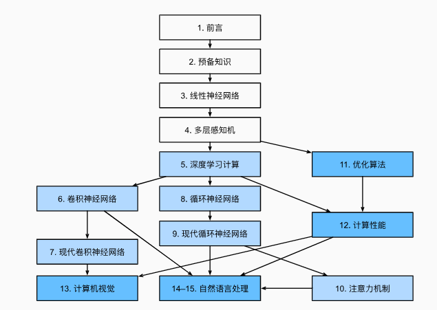

all in hpc
<!-- more -->

## 导论

### 机器学习框架的设计目标

广义来说，一个机器学习框架有以下的设计目标：
- 神经网络编程：根据各式需求定制不同的神经网络
- 自动微分：自动计算梯度以训练网络
- 数据管理和处理
- 模型训练和部署
- 与硬件加速器结合
- 分布式执行
  
在框架设计之初，开发者们曾尝试建立传统的**神经网络开发库**（如Theano和Caffe），以及**数据处理框架**（如Spark和Google Pregel）等方式达到以上设计目标，但各有不足：

|      方式      | 神经网络编程 | 自动微分 | 数据管理 | 训练和部署 | 硬件加速 | 分布式执行 |
| :------------: | :----------: | :------: | :------: | :--------: | :------: | :--------: |
| 传统神经网络库 |      √       |    √     |    ×     |     ×      |    √     |     ×      |
|  数据处理框架  |      ×       |    ×     |    √     |     ×      |    ×     |     √      |
|  机器学习框架  |      √       |    √     |    √     |     √      |    √     |     √      |

### 机器学习框架的基本组成

- 编程接口: 考虑到机器学习开发人员背景的多样性，机器学习框架首先需要提供以高层次编程语言（如Python）为主的编程接口。同时，机器学习框架为了优化运行性能，需要支持以低层次编程语言（如C和C++）为主的系统实现，从而实现操作系统（如线程管理和网络通讯等）和各类型硬件加速器的高效使用。

- 计算图： 利用不同编程接口实现的机器学习程序需要共享一个运行后端。实现这一后端的关键技术是计算图技术。计算图定义了用户的机器学习程序，其包含大量表达计算操作的算子节点（Operator Node），以及表达算子之间计算依赖的边（Edge）。

- 编译器前端： 机器学习框架往往具有AI编译器来构建计算图，并将计算图转换为硬件可以执行的程序。这个编译器首先会利用一系列编译器前端技术实现对程序的分析和优化。编译器前端的关键功能包括实现中间表示、自动微分、类型推导和静态分析等。

- 编译器后端和运行时： 完成计算图的分析和优化后，机器学习框架进一步利用编译器后端和运行时实现针对不同底层硬件的优化。常见的优化技术包括分析硬件的L2/L3缓存大小和指令流水线长度，优化算子的选择或者调度顺序。

- 异构处理器： 机器学习应用的执行由中央处理器（Central Processing Unit，CPU）和硬件加速器（如英伟达GPU、华为Ascend和谷歌TPU）共同完成。其中，非矩阵操作（如复杂的数据预处理和计算图的调度执行）由中央处理器完成。矩阵操作和部分频繁使用的机器学习算子（如Transformer算子和Convolution算子）由硬件加速器完成。

- 数据处理： 机器学习应用需要对原始数据进行复杂预处理，同时也需要管理大量的训练数据集、验证数据集和测试数据集。这一系列以数据为核心的操作由数据处理模块（例如TensorFlow的tf.data和PyTorch的DataLoader）完成。

- 模型部署： 在完成模型训练后，机器学习框架下一个需要支持的关键功能是模型部署。为了确保模型可以在内存有限的硬件上执行，会使用模型转换、量化、蒸馏等模型压缩技术。同时，也需要实现针对推理硬件平台（例如英伟达Orin）的模型算子优化。最后，为了保证模型的安全（如拒绝未经授权的用户读取），还会对模型进行混淆设计。

- 分布式训练： 机器学习模型的训练往往需要分布式的计算节点并行完成。其中，常见的并行训练方法包括数据并行、模型并行、混合并行和流水线并行。这些并行训练方法通常由远端程序调用（Remote Procedure Call, RPC）、集合通信（Collective Communication）或者参数服务器（Parameter Server）实现。

## 编程接口

### 机器学习系统编程模型的演进

机器学习系统的诞生初期，Lua（torch）或python（Theano）是主流编程语言，适用于小型和科研为导向的机器学习应用

神经网络在2011年快速崛起。而训练深度神经网络需要大量的算力，Torch和Theano无法为这些算力发挥做有力支撑。同时，计算加速卡如Nvidia 的通用API接口（如CUDA C）日趋成熟，且构建在CPU多核技术之上的多线程库也逐渐被广大开发者接受。许多开发者希望在C++的基础上开发高性能的深度学习应用。这一类需求被Caffe等一系列C++之上框架所满足

然而，机器学习模型往往需要在部署场景、数据类型、任务细节等需求上进行深度定制，这类定制任务涉及的背景多样，相关开发者往往无法基于C++熟练的完成任务。因此与C++的深度绑定，也成为了框架推广的制约。

2015年底Google率先推出tensorflow，相比传统的torch，TF采取前后端分离的设计理念，使用Python作为面向用户的主要前端语言，后端则使用相对高性能的C和C++实现。大量基于Python的前端API确保了TF可以被大量的数据/机器学习科学家接受，同时帮助TF快速融入以Python为主导的大数据生态。使得TF在保持后端高性能的同时，还兼具Python的灵活性和生态。这种设计理念也引领了后续Pytorch、MindSpore等机器学习框架的研发

### 机器学习工作流

1. 数据处理：首先，用户需要使用**数据处理API**来从磁盘中导入数据集，并完成数据的预处理
2. 模型定义：完成预处理后，用户需要**模型定义API**来定义机器学习模型，并需要提供特定的模型参数以供自定义
3. 优化器：模型的输出需要与用户的标签对比差异，一般是通过损失函数来评估效果。因此框架需要**优化器API**来支持用户定义自己的损失函数，并定义各种优化算法来计算梯度，完成模型参数的更新
4. 训练：用户可以使用**训练API**来定义循环、批量大小等以完成模型的训练，框架会自动完成前向传播、反向传播、梯度计算、参数更新等操作
5. 测试与调试：**测试API**用于对当前模型的精度进行评估

### 定义深度神经网络

**以层为核心，将提供的神经网络层组件按照网络结构进行堆叠和连接**

机器学习框架将神经网络层抽象为一个基类，如Pytorch中的torch.nn.Module，基于该基类延伸出如torch.nn.Conv2d，torch.nn.MaxPool2d的子类，用以实现特定的层的功能

### C/C++编程接口

现代机器学习框架主要依赖Pybind11来使大量的底层C/C++函数自动生成对应的Python接口，这一过程一般称为Python绑定

**使用C/C++自定义算子**

当框架自带的算子（即低级API）无法满足实际需要时，就需要手写算子，在机器学习框架中实现一个手写算子需要以下步骤：
1. 注册算子原语：定义算子信息，包括名字、类型约束、算子属性（如conv的stride、padding）等等，这些信息可以被框架用来进行优化，用户能够在后续直接使用这个算子
2. GPU Kernel实现：编写跑在kernel上的代码，包括声明Tensor大小，输入输出字节数、工作区大小等等，并实现线程调度、内存访问等操作
3. GPU Kernel注册：框架根据注册的算子原语以及I/O数据类型等信息，调用CUDA的内置数据类型对算子进行实例化

### 机器学习框架的编程范式

函数式编程：将计算视为函数的求值，而非改变状态和数据的操作。在函数式编程中，函数是一等公民，可以作为参数传递给其他函数，也可以作为返回值返回给调用者。同时，函数相互隔离也使并发行和并行性更容易管理

## 计算图

基本构成：基本数据结构——张量 + 基本运算单元——算子

### 静态生成

先编译后执行，将计算图定义与执行分离

使用前端语言定义模型形成完整的程序表达后，框架会首先对模型进行分析，得到网络层之前的拓扑关系以及参数变量设置、损失函数等信息，并将完整的模型描述编译为可被后端计算硬件调用执行的固定代码文本，这种固定的代码文本称为静态图

后端直接通过相应硬件调度执行图中的算子，也可以通过优化图结构（如融合算子）提高计算效率

静态编译并不读取输入数据，此时就需要一种特殊张量——占位符来辅助构建完整图

条件控制在静态图编译阶段不会完成判断，因此条件控制算子下的所有分支计算图都会纳入总计算图中

静态图具有两大优势：计算性能和直接部署。依靠静态图，框架可以掌握整个计算过程的全部信息，因此更容易制定优化策略，同时静态图由于只需编译一次，也支持序列化保存，在模型推理阶段直接执行保存的静态图，无需前端再次编译

劣势：开发繁琐，代码调试难度大，无法及时打印中间结果

### 动态生成

编译与执行同时发生。使用前端对代码完成模型构建后，动态生成并不利用编译器生成完整的静态计算图，而是利用前端的PythonAPI调用机器学习框架，利用框架自身的算子分发功能，将Python调用的算子上机进行计算，再将结果返回前端，继续下一个算子的计算。

因此，对于动态图，框架每个时间点都只处理当前的计算节点，无法获取到完整的模型结构，也较难进行优化

静态图可以很方便的构建出完整的前向计算图和反向计算图。而动态图由于边解析边执行，反向梯度计算的构建需要随着前向计算的调用同步执行。在前向执行的过程中，框架会根据算子的调用信息，记录对应的反向算子信息以及参与梯度计算的张量信息。前向计算完毕时，反向计算也完成记录

动态图模式更偏向于命令时编程范式，使用前端语言构建网络模型，也更加编程友好

|       特性       |       静态图       |       动态图       |
| :--------------: | :----------------: | :----------------: |
| 即时获取中间结果 |         否         |         是         |
|   代码调试难度   |         难         |         易         |
|  控制流实现方式  |      特定语法      |    前端语言语法    |
|       性能       | 优化策略多，性能佳 | 优化受限，性能一般 |
|     内存占用     |         少         |         多         |
|       部署       |      直接部署      |    不可直接部署    |

### 计算图调度

根据计算图可以找到相互独立的算子进行并发调度，提高计算的并行性。而存在依赖关系的算子则必须依次调度执行

## AI编译器与前端

前端图级别优化（硬件无关），后端硬件相关优化

AI编译器前端与传统编译器前端的最大不同：需要满足自动微分

### 中间表示 IR

#### 分类

**线性IR**
Linear IR是一种简单直接的中间表示，将前端的计算图直接转换为一系列的线性计算操作，每个操作都是一个算子，包括输入输出张量、算子类型、算子参数等信息

**图IR**
Graphical IR将编译信息保存到图中，通过图中的节点、边、树等表述算法，如AST、CFG、DAG等。图IR的优势在于可以更好的表达算法的结构信息，同时也更容易进行优化

**混合IR**
如LLVM IR，将线性IR和图IR结合，使用线性IR表示基本块，使用图IR表示块之间的控制流

#### 机器学习框架的IR

1. 张量表达：机器学习框架主要处理张量数据，IR必须可以支持张量的正确表达
2. 自动微分：IR需要考虑自动微分实现的简洁性、性能以及高阶微分的扩展能力
3. 计算图模式：需要同时支持静态图和动态图
4. 支持高阶函数和闭包：函数式编程的重要特性
5. 编译优化
6. JIT：满足实时编译

**PyTorch**
PyTorch基于动态图，使用TorchScript作为IR，支持Python和C++两种前端语言，支持JIT编译，支持自动微分，支持高阶函数和闭包

PyTorch采用命令式编程方式，通过JIT将Python代码即时编译为TorchScript

**Jax**
Jaxpr IR

### 自动微分

常见计算机程序求导的方法：
1. 手动微分：手工求解导数表达式，再由计算机代入求解
2. 数值微分：由导数定义，使用差分近似导数结果
3. 符号微分：计算机使用数学规则对函数表达式进行递归变换，但容易产生表达式膨胀
4. 自动微分：运用链式法则，将运算操作分解为一个有限的基本操作集合，在完成每一个基本操作的求导后，将结果组合得到整体程序的求导结果

对于某函数 $y = f(x_{1},x_{2}) = ln(x_{1}) + x_{1}x_{2} - sin{x_{2}}$ 计算其在 $(x_{1},x_{2})=(2,5)$ 处的导数 $\frac{\mathrm{d} y}{\mathrm{d} x_{1}}$ 

首先，框架会为其转出对应计算图：

前向模式：顺着计算图方向计算，依次计算算子对值以及算子对x1的梯度
反向模式：依次计算y对上一个算子的梯度，以此类推

在机器学习的应用中，输入的数量一般远大于输出数量，所以普遍采用反向模式的自动微分，即反向传播。（正向传播从输入开始，每个输入都要进行一次传播，而反向传播从输出开始，大部分情况只需要进行一次传播）

### 类型系统和静态分析

**类型系统**
类型的集合，以及使用类型来规定程序行为的规则。

机器学习框架一般使用Python作为描述模型结构的前端语言，Python作为动态强类型的语言，易上手且开发简洁高效，但由于其解释执行的方式，运行往往较慢。因此要想生成高效的后端代码，后端框架需要优化友好的静态强类型中间表示，就需要一种高效可靠的静态分析方法作为桥梁，比如Hindley–Milner（HM）类型系统

**静态分析**
过

### 常见前端编译优化方法

1. 无用和不可达代码消除：无用即输出不被其他任何代码使用；不可达指没有有效的控制流路径包含该代码。这类代码消除可使中间表示减负，提高程序编译运行速度
2. 常量传播和常量折叠：在编译时使用常量替换或直接运算出某些常量计算的结果
3. 公共子表达式消除

## 编译器后端和运行时