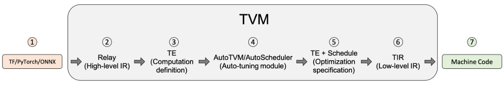

00
 <!--more-->

## Linux

### 系统启动过程

#### 内核引导
当计算机打开电源后，首先是BIOS开机自检，按照BIOS中设置的启动设备（通常是硬盘）来启动。操作系统接管硬件以后，首先读入 /boot 目录下的内核文件。

#### init
nit 进程是系统所有进程的起点，你可以把它比拟成系统所有进程的老祖宗，没有这个进程，系统中任何进程都不会启动。init 程序首先是需要读取配置文件 /etc/inittab

**运行级别**
许多程序需要开机启动。它们在Windows叫做"服务"（service），在Linux就叫做"守护进程"（daemon）。

init进程的一大任务，就是去运行这些开机启动的程序。

但是，不同的场合需要启动不同的程序，比如用作服务器时，需要启动Apache，用作桌面就不需要。

Linux允许为不同的场合，分配不同的开机启动程序，这就叫做"运行级别"（runlevel）。也就是说，启动时根据"运行级别"，确定要运行哪些程序。

Linux系统有7个运行级别(runlevel)：

- 0：系统停机状态，系统默认运行级别不能设为0，否则不能正常启动
- 1：单用户工作状态，root权限，用于系统维护，禁止远程登录
- 2：多用户状态(没有NFS)
- 3：完全的多用户状态(有NFS)，登录后进入控制台命令行模式
- 4：系统未使用，保留
- 5：X11控制台，登录后进入图形GUI模式
- 6：系统正常关闭并重启，默认运行级别不能设为6，否则不能正常启动

#### 系统初始化
在init的配置文件中有这么一行： si::sysinit:/etc/rc.d/rc.sysinit　它调用执行了/etc/rc.d/rc.sysinit。

rc.sysinit是一个bash shell的脚本，它主要是完成一些系统初始化的工作，是每一个运行级别都要首先运行的重要脚本。

它主要完成的工作有：激活交换分区，检查磁盘，加载硬件模块以及其它一些需要优先执行任务。

如在/etc/inittab可能会看到某条目`l5:5:wait:/etc/rc.d/rc 5` 这个条目的格式是 id:runlevels:action:process，代表在运行级别 5 下，init 应该运行 /etc/rc.d/rc 5 脚本（该脚本意思是启动运行级别5下的所有守护进程），并等待它结束

#### 建立终端
在init执行完inittab中启动守护进程的条目后，接下来是打开终端以方便用户交互
如`1:2345:respawn:/sbin/mingetty tty1` 表示运行级别2、3、4、5下，init应该运行/sbin/mingetty tty1，而且当它结束时，init应该重新运行它

### 目录结构
- /bin：
bin 是 Binaries (二进制文件) 的缩写, 这个目录存放着最经常使用的命令。

- /boot：
这里存放的是启动 Linux 时使用的一些核心文件，包括一些连接文件以及镜像文件。

- /dev ：
dev 是 Device(设备) 的缩写, 该目录下存放的是 Linux 的外部设备，在 Linux 中访问设备的方式和访问文件的方式是相同的。

- /etc：
etc 是 Etcetera(等等) 的缩写,这个目录用来存放所有的系统管理所需要的配置文件和子目录。

- /home：
用户的主目录，在 Linux 中，每个用户都有一个自己的目录，一般该目录名是以用户的账号命名的，如上图中的 alice、bob 和 eve。

- /lib：
lib 是 Library(库) 的缩写这个目录里存放着系统最基本的动态连接共享库，其作用类似于 Windows 里的 DLL 文件。几乎所有的应用程序都需要用到这些共享库。

- /lost+found：
这个目录一般情况下是空的，当系统非法关机后，这里就存放了一些文件。

- /media：
linux 系统会自动识别一些设备，例如U盘、光驱等等，当识别后，Linux 会把识别的设备挂载到这个目录下。

- /mnt：
系统提供该目录是为了让用户临时挂载别的文件系统的，我们可以将光驱挂载在 /mnt/ 上，然后进入该目录就可以查看光驱里的内容了。

- /opt：
opt 是 optional(可选) 的缩写，这是给主机额外安装软件所摆放的目录。比如你安装一个ORACLE数据库则就可以放到这个目录下。默认是空的。

- /proc：
proc 是 Processes(进程) 的缩写，/proc 是一种伪文件系统（也即虚拟文件系统），存储的是当前内核运行状态的一系列特殊文件，这个目录是一个虚拟的目录，它是系统内存的映射，我们可以通过直接访问这个目录来获取系统信息。
这个目录的内容不在硬盘上而是在内存里，我们也可以直接修改里面的某些文件，比如可以通过下面的命令来屏蔽主机的ping命令，使别人无法ping你的机器：
echo 1 > /proc/sys/net/ipv4/icmp_echo_ignore_all

- /root：
该目录为系统管理员，也称作超级权限者的用户主目录。

- /sbin：
s 就是 Super User 的意思，是 Superuser Binaries (超级用户的二进制文件) 的缩写，这里存放的是系统管理员使用的系统管理程序。

- /selinux：
 这个目录是 Redhat/CentOS 所特有的目录，Selinux 是一个安全机制，类似于 windows 的防火墙，但是这套机制比较复杂，这个目录就是存放selinux相关的文件的。

- /srv：
 该目录存放一些服务启动之后需要提取的数据。

- /sys：
这是 Linux2.6 内核的一个很大的变化。该目录下安装了 2.6 内核中新出现的一个文件系统 sysfs 。

sysfs 文件系统集成了下面3种文件系统的信息：针对进程信息的 proc 文件系统、针对设备的 devfs 文件系统以及针对伪终端的 devpts 文件系统。

该文件系统是内核设备树的一个直观反映。

当一个内核对象被创建的时候，对应的文件和目录也在内核对象子系统中被创建。

- /tmp：
tmp 是 temporary(临时) 的缩写这个目录是用来存放一些临时文件的。

- /usr：
 usr 是 unix shared resources(共享资源) 的缩写，这是一个非常重要的目录，用户的很多应用程序和文件都放在这个目录下，类似于 windows 下的 program files 目录。

- /usr/bin：
用户使用的应用程序。

- /usr/sbin：
超级用户使用的比较高级的管理程序和系统守护程序。

- /usr/src：
内核源代码默认的放置目录。

- /var：
var 是 variable(变量) 的缩写，这个目录中存放着在不断扩充着的东西，我们习惯将那些经常被修改的目录放在这个目录下。包括各种日志文件。

- /run：
是一个临时文件系统，存储系统启动以来的信息。当系统重启时，这个目录下的文件应该被删掉或清除。如果你的系统上有 /var/run 目录，应该让它指向 run。

### 常见命令

- ls：list
- cd：change directory
- pwd：print working directory
- cat：concatenate
- less：
- cp：copy
- mv：move
- rm：remove
- mkdir：make directory
- rmdir：remove directory
- man：manual
- ps：process statussss

### 文件基本属性
chown 修改所属用户及用户组 chmod修改文件权限

把每一组rwx看作二进制计数，即chmod 777代表了文件所有者、文件所有者同组用户、其他用户都有rwx权限

## Docker

Docker依赖于已存在并运行的Linux内核环境，因此windows上的Docker需要在虚拟机中运行

docker run：用于从一个 Docker 镜像创建并启动一个新的容器
`docker run -it ubuntu:latest /bin/bash`
-i代表容器的标准输入保持开启，即可以向容器发送输入
-t代表为容器分配一个伪终端，可以看到命令行

start：启动一个已经存在的容器

exec：对一个正在运行的容器执行一个命令
`docker exec -it my_container /bin/bash`
在exec之前容器就已经有一个或多个进程，因此exec的命令会在容器中启动一个新的进程，此时exit容器由于还有别的进程所以并不会直接停止

attach：为正在运行的容器启动一个shell，同样退出时不会停止容器